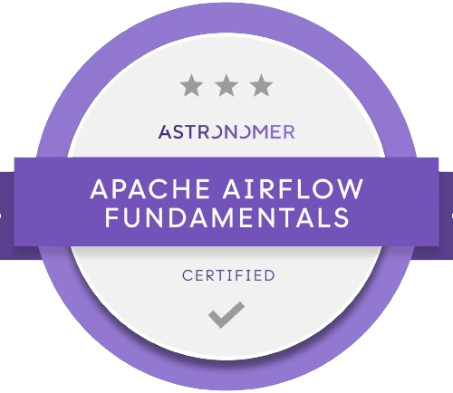

----
#### A 22yo Front-end Developer and UI/UX enthusiast. Willing to use technology to create a better world :sparkles:

- :raising_hand_woman: She/Her  
- :mortar_board: Bachelor in Information Systems - ESPM  
- :star: Co-founder and developer of <i>:construction: Comming Soon :eyes: ... :construction:</i>
- :white_check_mark: Finished The Odin Project Foundations course and fully recommend it for those who are beginners!
- :dart: Currently doing [The Odin Project](https://www.theodinproject.com/)'s FullStack JavaScript Course!

## Languages and Tools
<!--
 
-->

 

## Certifications, Badges & Courses

<a href="https://drive.google.com/file/d/16CwADvhwJUimWmLz5FfkDro9DToTAGE5/view" target="_blank" rel="noopener noreferrer"><a>

## Find me on

## Github Stats
<table align="center" width="100%" height="100%" >
    <tr>
        <td></td>
        <td>
        <td></td>
        <td></td>
    </tr>
</table>
<!--
<table align="center" width="100%" height="100%" >
    <tr>
        <td></td>
        <td>
        <td></td>
        <td></td>
    </tr>
</table>
-->

  See my ⭐<a href="https://github.com/FShinoda?tab=stars">Stars section</a> for a more organized repos view!

